# Samsung GEO Tool - System Architecture

> Last Updated: 2026-02-02

## Overview

Samsung GEO Tool은 Samsung 제품의 마케팅 콘텐츠를 AI를 활용하여 자동 생성하는 플랫폼입니다. 7단계 파이프라인을 통해 YouTube, Instagram, TikTok 등 다양한 플랫폼에 최적화된 콘텐츠를 생성합니다.

---

## 1. High-Level System Architecture

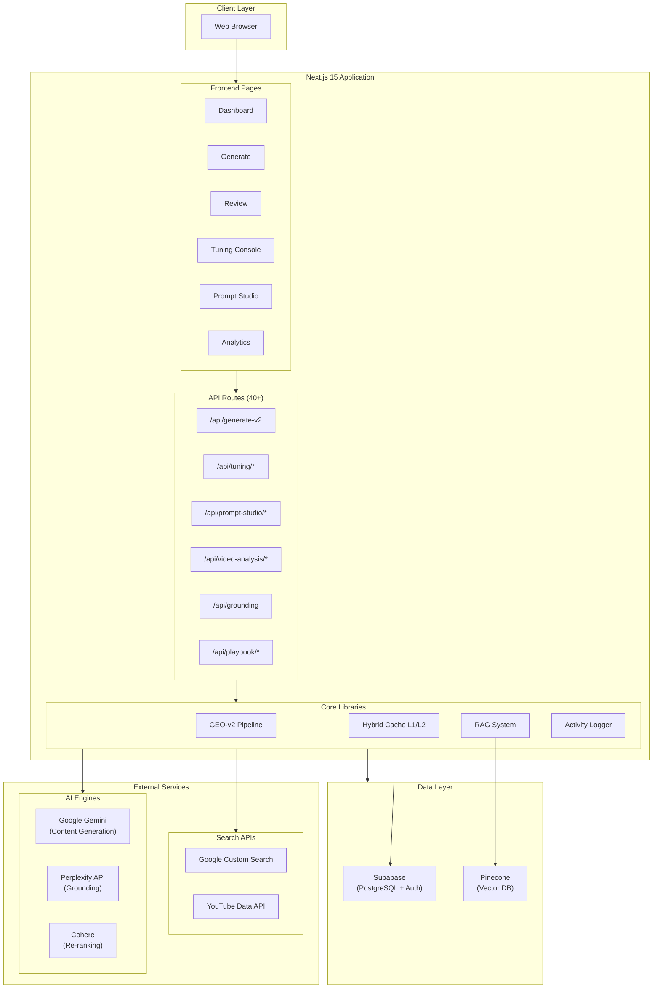

---

## 2. Directory Structure

```
samsung-geo-tool/
├── src/
│   ├── app/                          # Next.js App Router
│   │   ├── (auth)/                   # Auth routes (login)
│   │   ├── (dashboard)/              # Protected dashboard routes
│   │   │   ├── generate/             # Content generation UI
│   │   │   ├── review/               # Content review
│   │   │   ├── tuning/               # Prompt tuning console
│   │   │   ├── analytics/            # Analytics dashboard
│   │   │   ├── briefs/               # Product brief management
│   │   │   ├── settings/             # User settings
│   │   │   ├── history/              # Generation history
│   │   │   ├── activity-logs/        # Activity logs
│   │   │   └── dashboard/            # Main dashboard
│   │   ├── admin/
│   │   │   └── prompt-studio/        # Prompt refinement interface
│   │   └── api/                      # REST API routes (40+ endpoints)
│   ├── components/                   # React components
│   │   ├── features/                 # Feature-specific components
│   │   ├── prompt-studio/            # Prompt refinement UI
│   │   ├── tuning/                   # Tuning console UI
│   │   ├── analytics/                # Analytics components
│   │   ├── settings/                 # Settings components
│   │   └── ui/                       # Radix UI + Aceternity UI
│   ├── lib/                          # Core business logic
│   │   ├── geo-v2/                   # 7-stage pipeline (30+ modules)
│   │   ├── tuning/                   # Prompt/weights management
│   │   ├── prompt-studio/            # Prompt refinement logic
│   │   ├── rag/                      # RAG with Pinecone + Cohere
│   │   ├── video-analysis/           # Gemini video analysis
│   │   ├── cache/                    # Hybrid L1/L2 caching
│   │   ├── logging/                  # Activity & API logging
│   │   ├── supabase/                 # Database access
│   │   └── geo-verification/         # Fact verification
│   ├── types/                        # TypeScript type definitions
│   └── data/                         # Configuration data
├── supabase/schema.sql               # Database schema
├── docs/                             # Documentation
└── public/                           # Static assets
```

---

## 3. 7-Stage Pipeline Architecture

### Pipeline Flow

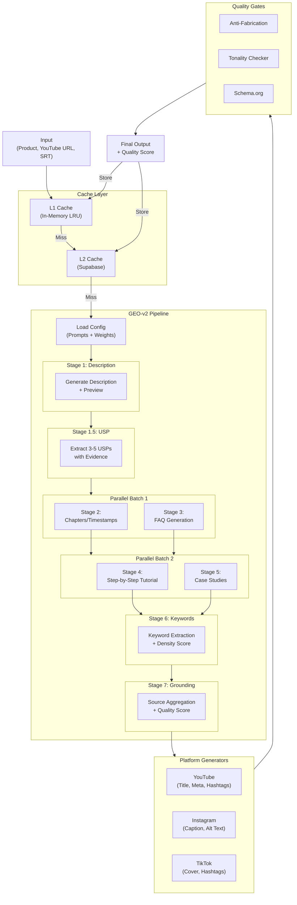

### Stage Details

| Stage | Name | Input | Output | Key Module |
|-------|------|-------|--------|------------|
| 1 | Description | SRT, URL, Product | Preview + Full Description | `pipeline.ts` |
| 1.5 | USP Extraction | Description, Keywords | 3-5 USPs with Evidence | `usp-extraction.ts` |
| 2 | Chapters | Description, SRT | Timestamps, Auto-flag | (parallel) |
| 3 | FAQ | Description, USPs | FAQ Items with Answers | (parallel) |
| 4 | Tutorial | Description | Step-by-Step Guide | (parallel) |
| 5 | Case Studies | Description, USPs | 2-3 Case Studies | (parallel) |
| 6 | Keywords | All Previous | Product + Generic Keywords | `pipeline.ts` |
| 7 | Grounding | All Sources | Aggregated Sources, Score | `grounding-scorer.ts` |

### Platform-Specific Generators

| Platform | Generators |
|----------|------------|
| **YouTube** | Title, Meta Tags, Timestamps, Hashtags, Schema.org |
| **Instagram** | Caption, Alt Text, Engagement Comments, Hashtags |
| **TikTok** | Cover Text, Hashtags |

---

## 4. AI Engines Integration

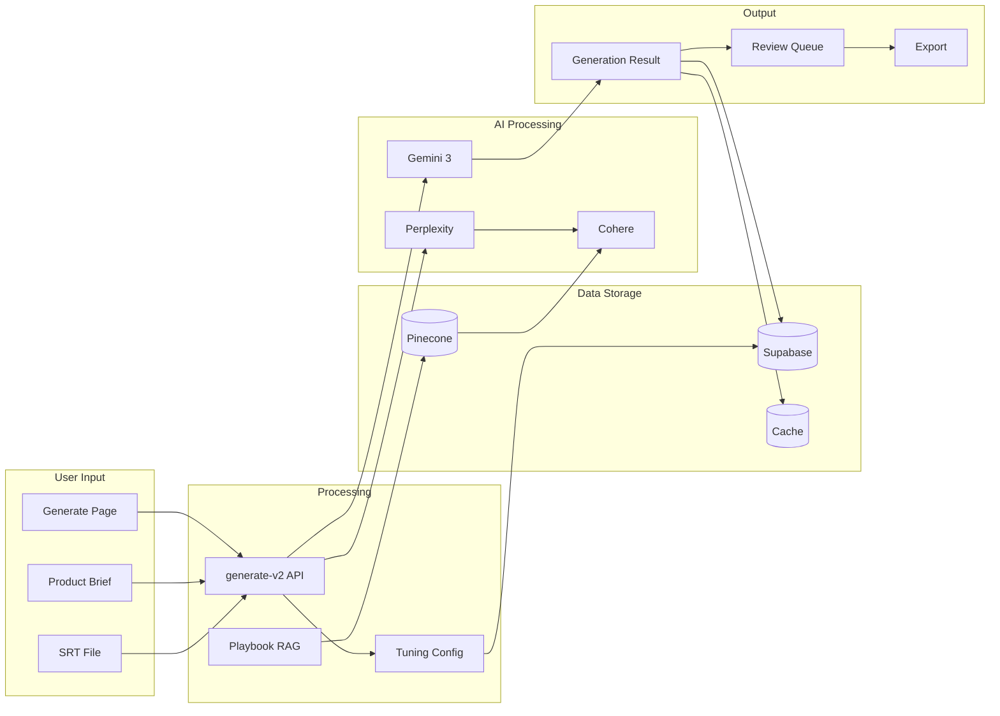

### AI Engine Specifications

| Engine | Purpose | Model | Role |
|--------|---------|-------|------|
| **Google Gemini** | Content Generation | `gemini-3-flash-preview` / `gemini-3-pro-preview` | Primary generation engine |
| **Perplexity** | Grounding/Fact Verification | `pplx-latest` | Grounding stage (stage 1.5) |
| **Cohere** | Re-ranking (RAG) | `rerank-v3-english` | Search result ranking |
| **Google Search** | Web Search Grounding | Custom CX | Fact checking |
| **YouTube Data API** | Video Grounding | - | Source discovery |

---

## 5. Database Schema

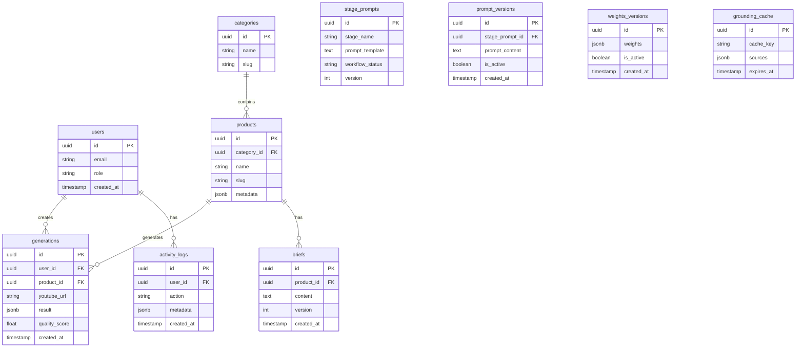

### Core Tables

| Table | Purpose |
|-------|---------|
| `users` | Auth synced users |
| `categories` | Product categories (Mobile, Watch, Ring, Buds, Laptop, XR) |
| `products` | Samsung products (Galaxy S25, Watch 7, Ring 2, etc.) |
| `briefs` | Product brief versioning (1 per product) |
| `generations` | Generated content logs |
| `stage_prompts` | Prompt Studio stage configurations |
| `prompt_versions` | Version tracking for prompts |
| `weights_versions` | Version tracking for scoring weights |
| `grounding_cache` | Cached grounding results |
| `activity_logs` | User activity tracking |
| `api_call_logs` | API call tracking |
| `generation_event_logs` | Generation event tracking |
| `generation_cache` | L2 generation cache |

---

## 6. API Routes

### Generation & Content

| Endpoint | Method | Description |
|----------|--------|-------------|
| `/api/generate-v2` | POST | 7-stage pipeline main endpoint |
| `/api/generate-v2-stream` | POST | Streaming responses |
| `/api/generations` | GET | List/fetch generations |
| `/api/briefs` | GET/POST | Product brief management |
| `/api/review` | GET/POST | Content review workflow |

### Tuning & Configuration

| Endpoint | Method | Description |
|----------|--------|-------------|
| `/api/tuning/prompts` | GET/POST | Load/save prompts |
| `/api/tuning/prompts/test` | POST | Test prompt variants |
| `/api/tuning/weights` | GET/POST | Load/save scoring weights |
| `/api/tuning/batch` | POST | Batch generation processing |
| `/api/tuning/blacklist` | GET/POST | Manage blacklist |

### Prompt Studio

| Endpoint | Method | Description |
|----------|--------|-------------|
| `/api/prompt-studio/stages` | GET | List pipeline stages |
| `/api/prompt-studio/stages/[stage]` | GET/PUT | Stage configuration |
| `/api/prompt-studio/stages/[stage]/test` | POST | Test stage |
| `/api/prompt-studio/refine` | POST | Refine prompts |
| `/api/prompt-studio/evaluate` | POST | Evaluate refinements |

### Video Analysis

| Endpoint | Method | Description |
|----------|--------|-------------|
| `/api/video-analysis` | POST | Upload/analyze videos |
| `/api/video-analysis/analyze` | POST | Trigger analysis |
| `/api/video-analysis/[id]` | GET | Fetch analysis results |
| `/api/video-analysis/thumbnails` | GET | Thumbnail generation |

### Grounding & RAG

| Endpoint | Method | Description |
|----------|--------|-------------|
| `/api/grounding` | POST | Grounding service |
| `/api/geo-verification/run` | POST | Fact verification |
| `/api/playbook/search` | POST | Search Samsung playbook |
| `/api/playbook/ingest` | POST | Ingest playbook docs |
| `/api/playbook/vectors` | GET/DELETE | Manage embeddings |

---

## 7. Caching Architecture

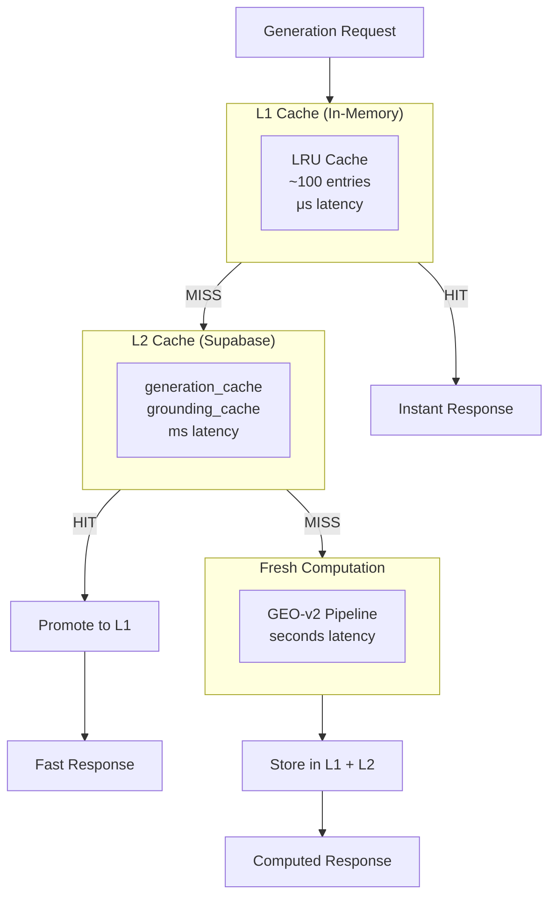

### Cache Strategy

| Layer | Storage | Latency | Capacity | Persistence |
|-------|---------|---------|----------|-------------|
| **L1** | In-Memory LRU | μs | ~100 entries | No |
| **L2** | Supabase | ms | Unlimited | Yes |

**Cache Key Format**: `[productName]_[youtubeUrl]_[srtHash]_[platform]`

---

## 8. Prompt Tuning Workflow

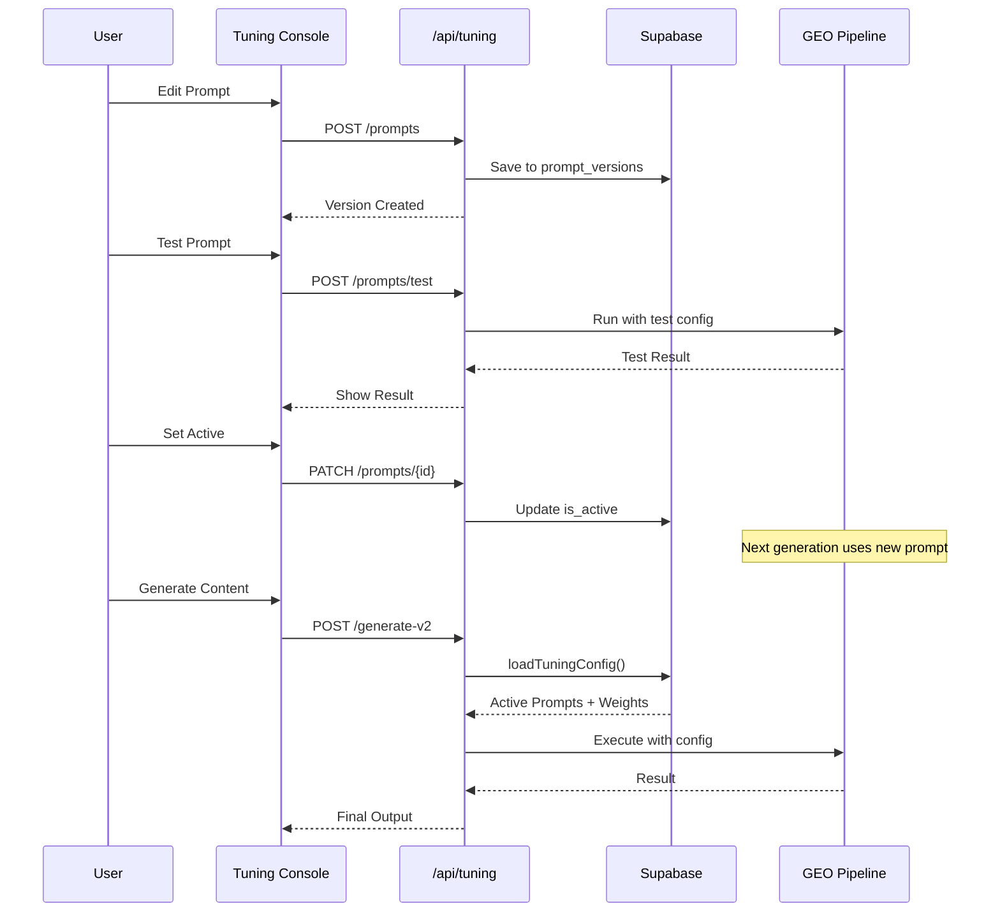

### Configuration Flow

```
Settings UI → /api/tuning/prompts → prompt_versions table → loadTuningConfig() → generate-v2 pipeline
```

---

## 9. Technology Stack

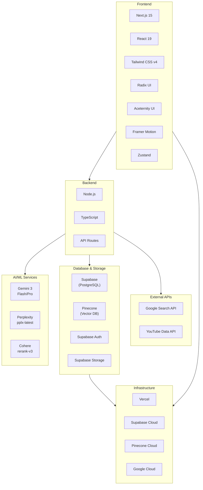

### Stack Summary

| Layer | Technologies |
|-------|--------------|
| **Frontend** | Next.js 15, React 19, Tailwind CSS v4, Radix UI, Aceternity UI, Framer Motion, Zustand |
| **Backend** | Node.js, TypeScript, Next.js API Routes |
| **AI/ML** | Gemini 3 (Flash/Pro), Perplexity API, Cohere (rerank-v3) |
| **Database** | Supabase (PostgreSQL), Pinecone (Vector DB) |
| **External APIs** | Google Search API, YouTube Data API |
| **Infrastructure** | Vercel, Supabase Cloud, Pinecone Cloud, Google Cloud |

---

## 10. Infrastructure Architecture

### Unified Infrastructure View

Samsung GEO Tool의 전체 인프라와 데이터 흐름을 보여주는 통합 다이어그램입니다.

**목적**: Samsung 제품의 마케팅 콘텐츠를 AI로 자동 생성하여 YouTube, Instagram, TikTok 등에 배포

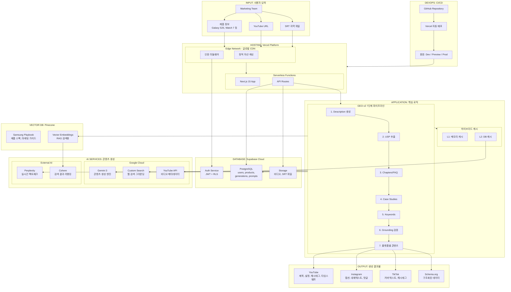

### 서비스별 역할 및 비용 구조

| 서비스 | 역할 | 비용 모델 |
|--------|------|-----------|
| **Vercel** | Next.js 호스팅, 서버리스 함수, 글로벌 CDN | 사용량 기반 (함수 호출, 대역폭) |
| **Supabase** | PostgreSQL DB, 인증, 파일 스토리지 | 티어 기반 (DB 크기, 사용자 수) |
| **Pinecone** | 벡터 DB, RAG 검색 | 팟 기반 (벡터 수, 쿼리 수) |
| **Gemini** | 콘텐츠 생성 (메인 엔진) | 토큰 기반 (입출력 토큰) |
| **Perplexity** | 실시간 웹 검색, 팩트 그라운딩 | 요청 기반 (API 호출 수) |
| **Cohere** | 검색 결과 리랭킹, 임베딩 | 토큰 기반 (리랭크 연산) |
| **Google Search** | 웹 검색 그라운딩 | 쿼리 기반 (일 100회 무료) |

### 데이터 흐름 요약

```
사용자 입력 → Vercel Edge → API Route → 인증 확인 → 캐시 체크
                                                    ↓
                                          ┌─ L1 HIT → 즉시 반환
                                          ├─ L2 HIT → L1 승격 → 반환
                                          └─ MISS → AI 파이프라인 실행
                                                    ↓
                                          7단계 생성 → 캐시 저장 → 결과 반환
```

### Infrastructure Summary Table

| Layer | Components | Purpose | Scaling |
|-------|------------|---------|---------|
| **User** | Browser, Mobile | Client access | N/A |
| **Edge** | Vercel CDN, Middleware | Caching, Auth, Rate limit | Auto (Global) |
| **Application** | Next.js, API Routes | Business logic, Pipeline | Auto (0→N) |
| **Data** | Supabase, Pinecone | Persistence, Vector search | Tier-based |
| **AI** | Gemini, Perplexity, Cohere | Content generation, Grounding | Rate-limited |
| **DevOps** | GitHub, Vercel CI/CD | Source control, Deployment | N/A |
| **Security** | Env vars, JWT, RLS | Authentication, Authorization | N/A |

### Data Flow Summary

```
User Request → Edge (Cache Check) → API Route → Auth Verify → Pipeline Execute
    ↓
    ├─→ L1 Cache (Memory) → HIT → Return
    ├─→ L2 Cache (Supabase) → HIT → Promote to L1 → Return
    └─→ MISS → AI Generation → Store Cache → Return
```

---

### Cloud Infrastructure Diagram

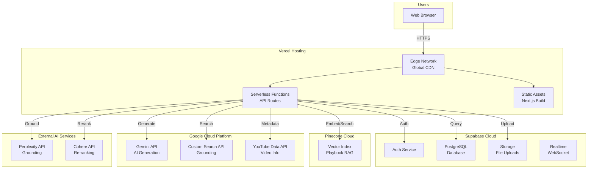

### Deployment Architecture

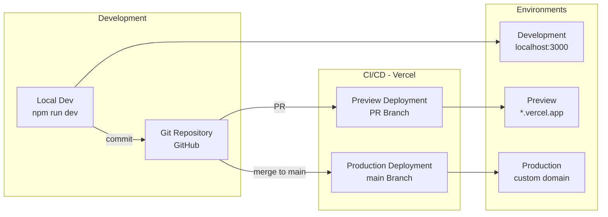

### Infrastructure Components

| Component | Service | Region | Purpose |
|-----------|---------|--------|---------|
| **Hosting** | Vercel | Global (Edge) | Next.js hosting, serverless functions |
| **Database** | Supabase | - | PostgreSQL, Auth, Storage |
| **Vector DB** | Pinecone | - | Playbook embeddings, RAG search |
| **AI Generation** | Google Gemini | - | Content generation |
| **AI Grounding** | Perplexity | - | Fact verification, web search |
| **AI Ranking** | Cohere | - | Search result re-ranking |
| **Search** | Google Custom Search | - | Web search for grounding |
| **Video** | YouTube Data API | - | Video metadata extraction |

### Request Flow

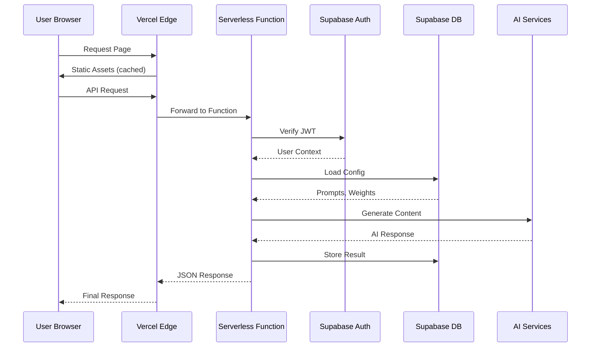

### Scaling Characteristics

| Layer | Scaling Model | Limits |
|-------|---------------|--------|
| **Vercel Edge** | Auto-scale (Global) | Unlimited requests |
| **Serverless Functions** | Auto-scale (0 to N) | 10s default timeout, 60s max |
| **Supabase** | Connection pooling | Based on plan tier |
| **Pinecone** | Pod-based scaling | Based on plan tier |
| **AI APIs** | Rate limited | Per-API quotas |

### Environment Configuration

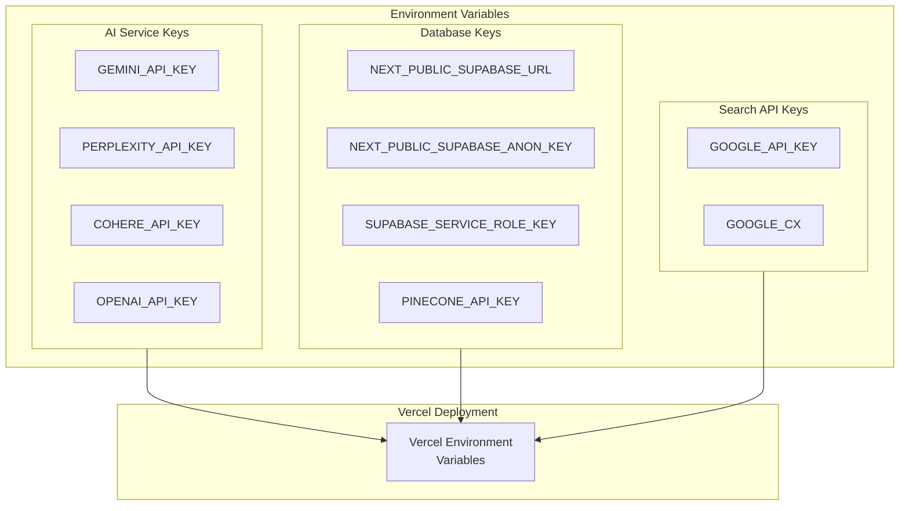

### Security Architecture

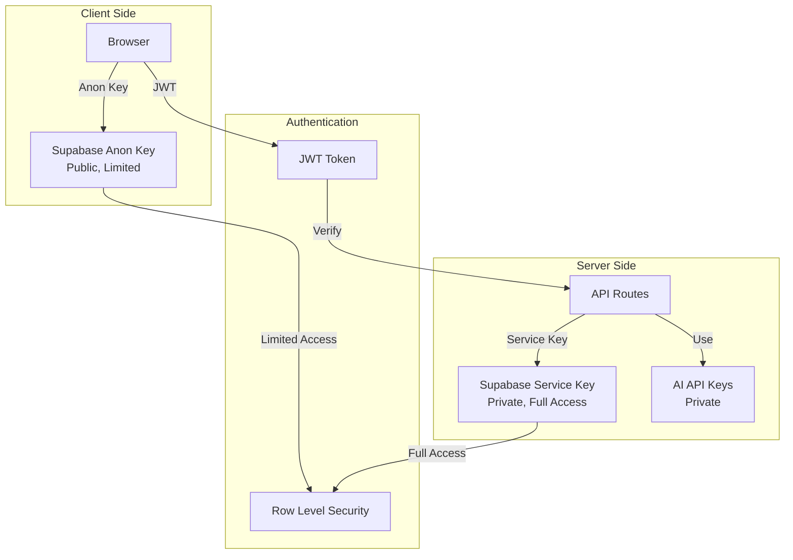

### Cost Structure

| Service | Billing Model | Primary Cost Driver |
|---------|---------------|---------------------|
| **Vercel** | Usage-based | Function invocations, bandwidth |
| **Supabase** | Tier-based | Database size, auth users |
| **Pinecone** | Pod-based | Vector count, queries |
| **Gemini** | Token-based | Input/output tokens |
| **Perplexity** | Request-based | API calls |
| **Cohere** | Token-based | Rerank operations |
| **Google Search** | Query-based | Search queries/day |

### Monitoring & Observability

| Aspect | Tool | Data |
|--------|------|------|
| **Application Logs** | Vercel Logs | API requests, errors |
| **Database Metrics** | Supabase Dashboard | Queries, connections |
| **Custom Analytics** | `activity_logs` table | User actions, generations |
| **API Tracking** | `api_call_logs` table | Latency, errors |
| **Generation Events** | `generation_event_logs` | Pipeline stages |

---

## 11. Key Features

### Content Generation
- 7-stage pipeline with parallel execution
- Multi-platform support (YouTube, Instagram, TikTok)
- USP-centric content architecture
- Grounding quality scoring
- Anti-fabrication guardrails

### Tuning & Configuration
- Prompt Studio for iterative refinement
- Prompt versioning & deployment
- Scoring weights configuration
- Batch testing
- Real-time feedback & metrics

### Video Analysis
- Gemini video understanding
- Automatic SRT extraction
- Content type detection
- Visual analysis

### Content Review
- Multi-step review workflow
- Quality gates before publishing
- Approval tracking
- Content confirmation

### Analytics & Monitoring
- Generation metrics
- Source click tracking
- User engagement
- Performance analytics
- Activity logging

---

## 12. Environment Variables

```bash
# AI Services
GEMINI_API_KEY=
PERPLEXITY_API_KEY=
COHERE_API_KEY=

# Database
NEXT_PUBLIC_SUPABASE_URL=
NEXT_PUBLIC_SUPABASE_ANON_KEY=
SUPABASE_SERVICE_ROLE_KEY=

# Vector DB
PINECONE_API_KEY=
PINECONE_INDEX_NAME=

# Search APIs
GOOGLE_API_KEY=
GOOGLE_CX=
```

---

## 13. Supabase Configuration

- **Project ID**: `bizvgdpbuhvvgfihmlgj`
- **Admin Email**: admin@admin.com
- **Admin Password**: admin123

---

## 14. Key Architecture Decisions

1. **USP-Centric Design**: The entire pipeline revolves around extracting and validating unique selling points
2. **Multi-Engine AI**: Leverages different AI models for different purposes (Gemini for generation, Perplexity for grounding, Cohere for ranking)
3. **Highly Configurable**: Prompts, weights, and parameters can be tuned without code changes
4. **Quality-Focused**: Multiple validation layers (anti-fabrication, tonality checking, grounding quality scoring)
5. **Extensible**: Easy to add new pipeline stages or platform-specific generators
6. **Performant**: Hybrid caching, parallel execution, streaming responses
7. **Observable**: Comprehensive logging for debugging and optimization

---

## Appendix: File References

### Core Pipeline
- `src/lib/geo-v2/pipeline.ts` - Main pipeline orchestrator
- `src/lib/geo-v2/usp-extraction.ts` - USP extraction module
- `src/lib/geo-v2/grounding-scorer.ts` - Grounding quality scorer
- `src/lib/geo-v2/anti-fabrication.ts` - Content validation

### Platform Generators
- `src/lib/geo-v2/title-generator.ts` - YouTube titles
- `src/lib/geo-v2/meta-tags-generator.ts` - SEO meta tags
- `src/lib/geo-v2/instagram-description-generator.ts` - Instagram captions
- `src/lib/geo-v2/hashtag-generator.ts` - Platform-specific hashtags
- `src/lib/geo-v2/schema-generator.ts` - Schema.org structured data

### Configuration
- `src/lib/tuning/prompt-loader.ts` - Prompt configuration loader
- `src/lib/tuning/weights-loader.ts` - Scoring weights loader
- `src/lib/cache/hybrid-cache.ts` - L1/L2 cache implementation
